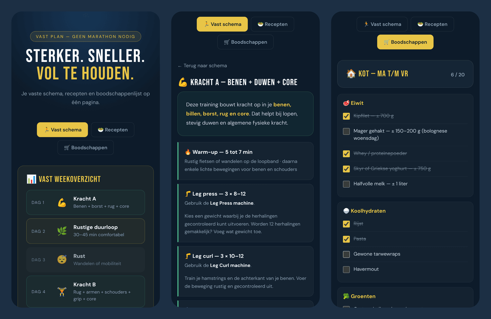

# Mijn vaste plan

A personal planner I use every week: a fixed training schedule, a 7-day menu
with recipes, and a shopping list that remembers what I already have. Built as
an installable, offline-capable web app (PWA), so it also works in the gym and
in the supermarket without a connection.



The interface is in Dutch; the code and documentation are in English.

## Features

- **Training schedule**: seven days, each linking to a workout with its steps
- **Menu and recipes**: the week menu highlights today and links to each recipe
- **Shopping list**: ticks are saved on the device, with a counter per list.
  "Nieuwe week starten" unticks what is bought weekly and keeps the stock
- **Installable and offline**: a service worker caches the whole app,
  including fonts
- **No backend and no tracking**: everything stays in the browser

## Tech stack

| Area      | Technology                                            |
| --------- | ----------------------------------------------------- |
| UI        | Vue 3 (Composition API, `<script setup>`), Vue Router |
| Language  | TypeScript in strict mode                             |
| Build     | Vite, `vite-plugin-pwa` (Workbox service worker)      |
| Tests     | Vitest, Vue Test Utils, jsdom                         |
| Quality   | ESLint, Prettier, `vue-tsc`                           |
| CI and CD | GitHub Actions, deployed to GitHub Pages              |

## Project structure

```text
src
├── data/          the content: schedule, workouts, recipes, menu, shopping list
├── types.ts       the types that content is checked against
├── lib/           small pure functions (rich text, dates, storage)
├── composables/   useShoppingList: state and rules of the shopping list
├── components/    reusable UI parts
├── views/         one component per page
└── router.ts      routes and scroll behaviour
```

## Getting started

Requirements: Node.js 22+ and [pnpm](https://pnpm.io/).

```bash
pnpm install
pnpm dev          # http://localhost:5173
```

| Command           | What it does                               |
| ----------------- | ------------------------------------------ |
| `pnpm dev`        | Development server with hot reload         |
| `pnpm build`      | Type-check and build to `dist/`            |
| `pnpm preview`    | Serve the production build locally         |
| `pnpm test`       | Run the unit and component tests           |
| `pnpm lint`       | ESLint                                     |
| `pnpm type-check` | TypeScript check of `.ts` and `.vue` files |
| `pnpm format`     | Format everything with Prettier            |

## Changing the content

All content lives in `src/data` as typed data, separate from the layout. To
add a recipe, add an object to `recipes` in `src/data/recipes.ts`; the overview
page and its detail page follow automatically. TypeScript reports a missing
field, and the tests in `src/data/data.spec.ts` report a link to a recipe or
workout that does not exist.

## Design decisions

- **Content as typed data instead of one HTML file per page.** The first
  version had 19 HTML pages that each repeated the same head and markup. Now a
  page is a data object and one component renders them all.
- **A real router instead of an iframe.** The first version loaded pages into
  an iframe and resized it with JavaScript. With Vue Router every page has its
  own URL, and the back button and deep links work.
- **Hash URLs (`#/recepten`).** GitHub Pages only serves static files, so a
  path like `/recepten` would be a 404 after a reload. With hash URLs the
  server always sees `index.html`.
- **Relative asset paths (`base: './'`).** The same build works under
  `https://<user>.github.io/<repo>/` and anywhere else.
- **Shopping list logic outside the components.** `createShoppingList` takes
  the items and a storage object as arguments, so it is tested with a small
  list and an in-memory storage, without a browser.
- **Backwards-compatible storage.** The list still uses the storage key and
  format of the first version, so existing ticks survived the rewrite. Stored
  data is validated when it is read.
- **No `v-html`.** Bold text in the content is written as `**text**` and
  rendered as elements by a small parser, so content can never inject markup.
- **Self-hosted fonts.** No request to Google Fonts: better for privacy, and
  the fonts are available offline.

## Deployment

Every push to `main` runs the checks and, when they pass, publishes `dist/` to
GitHub Pages. This needs one setting in the repository:
**Settings → Pages → Build and deployment → Source: GitHub Actions**.

## Possible improvements

- Edit the menu and shopping list in the app instead of in the data files
- Log completed workouts and show progress over time
- Sync between devices (would need a backend and accounts)
